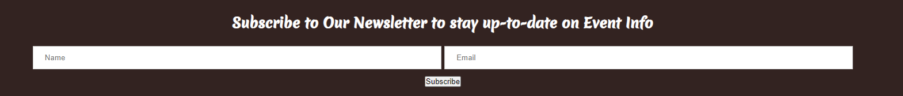
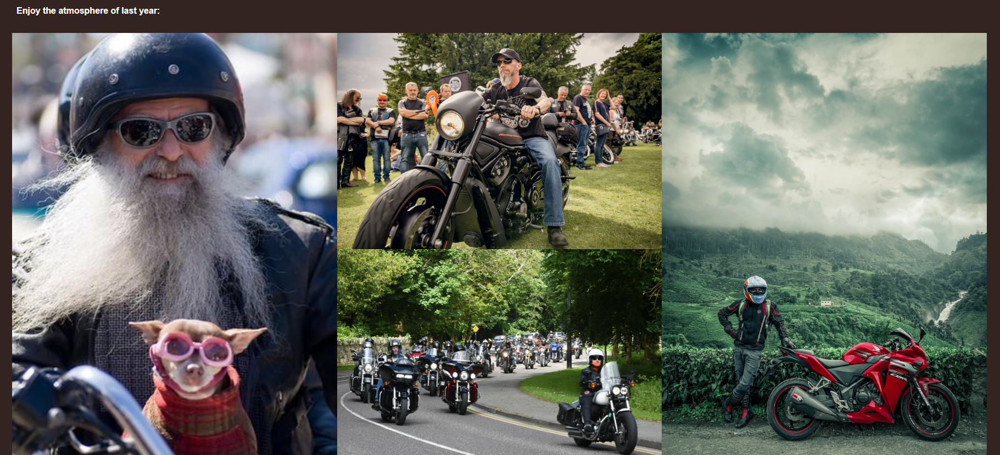
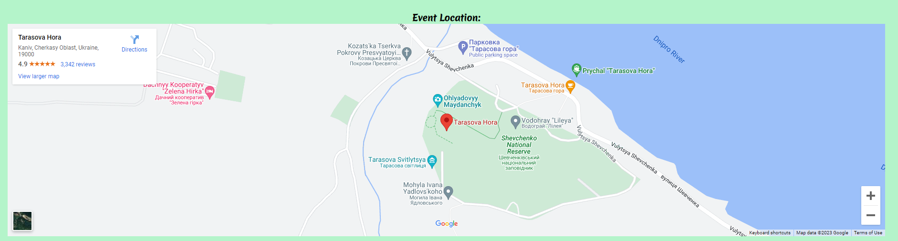

# **Event Page for WEB-MOTO**

## **Summary:**
As part of a class hackathon to design a online web application we decided as a group to add an additional page to this previously designed web site which was submitted my our team member Sergiy as part of his PP1 Project. The main goal of this page is to add an additional page for a bike-meetup event. The event would feature a group ride-along and allow users to test drive various motorcycles as part of a sponsorship deal with various bike dealerships across Ukraine.

## **Planning**
To plan for this we first sat down as a group and using the AGILE Software method we first determined the project objectives. After outlining our objectives for the project we began to determine the scope of the project. We done this by creating a multitude of user-stories and using these user stories we where able to create multiple tasks to be completed in the form of iterations. We listed these iterations in levels of importance in accordance with AGILE Product Backlog Principals. We then divided out the tasks amongst the groups members and began the project.

---

## **User Experience**

### **User Stories**

- As a user I would like a map of the event location so I can plan out what local sites I can see while there.
- As a user I would like to sign up to a newsletter so I can keep updated on any event info.
- As a bike enthusiast, I would like to know what makes this ride interesting so I can make an informed choice.
- As a potential user, I would like to see photos of previous years events so that I can visualise what takes place at this event.

### **Features**

- Event Newsletter: Added an event newsletter so that users can signup for an email newsletter to keep up-to-date on event info

- Event Gallery: Added an event gallery to showcase too users the previous years event

- Event Location Google Maps: Added a Google Maps display to show users the area the next years event will take place at.

---

## Technologies Used:

- HTML5
- CSS3

## Credits:

Event Page Created as apart of a Hackathon

Page Creators:

- Zaur Time
- Hubert Maraszek
- Calum Griffin
- Kristina Orlichenko
- Sergiy Kochenko
